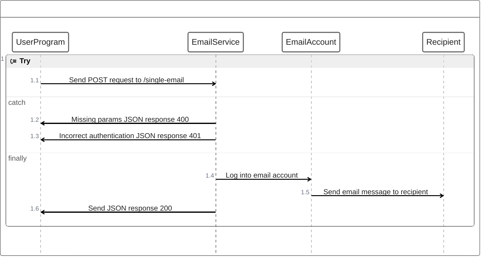

# demo_email_service microservice

Send email message given a recipient email address, subject line, and body message

# Communication Contract

## Email REST API

### API Overview
- Base URL: https://emailservice-53195221677.us-west1.run.app
- Authentication: Requires an API key
- Request Format: JSON
- Response Format: JSON

## How to send email request
### For single email message

#### Endpoint: /single-email

#### Method: POST

#### Request Body: 

Send a JSON object containing: 
- "email" (string, required) - The recipient email address
- "subject" (string, required) - The email subject line
- "message" (string, required) - The email message body
- "auth_key" (strign, required) - The provisioned API service authentication key

#### Example call (python):

```python

URL = "https://emailservice-53195221677.us-west1.run.app/single-email"
HEADERS = {'Content-Type': 'application/json'}

payload = {
    "email": "test@example.com",
    "subject": "Test Subject",
    "message": "This is a test message",
    "auth_key": "provisioned_key"
}

response = requests.post(
    URL,
    headers=HEADERS,
    json=payload
)
response = requests.get(url, params=params)
```

#### Example call curl

```bash
curl -X POST http://localhost:8080/single-email \
  -H "Content-Type: application/json" \
  -d '{
    "email": "test@example.com",
    "subject": "Test Subject",
    "message": "Test Message",
    "auth_key": provisioned_key
  }'

```

## UML Sequence Diagram

